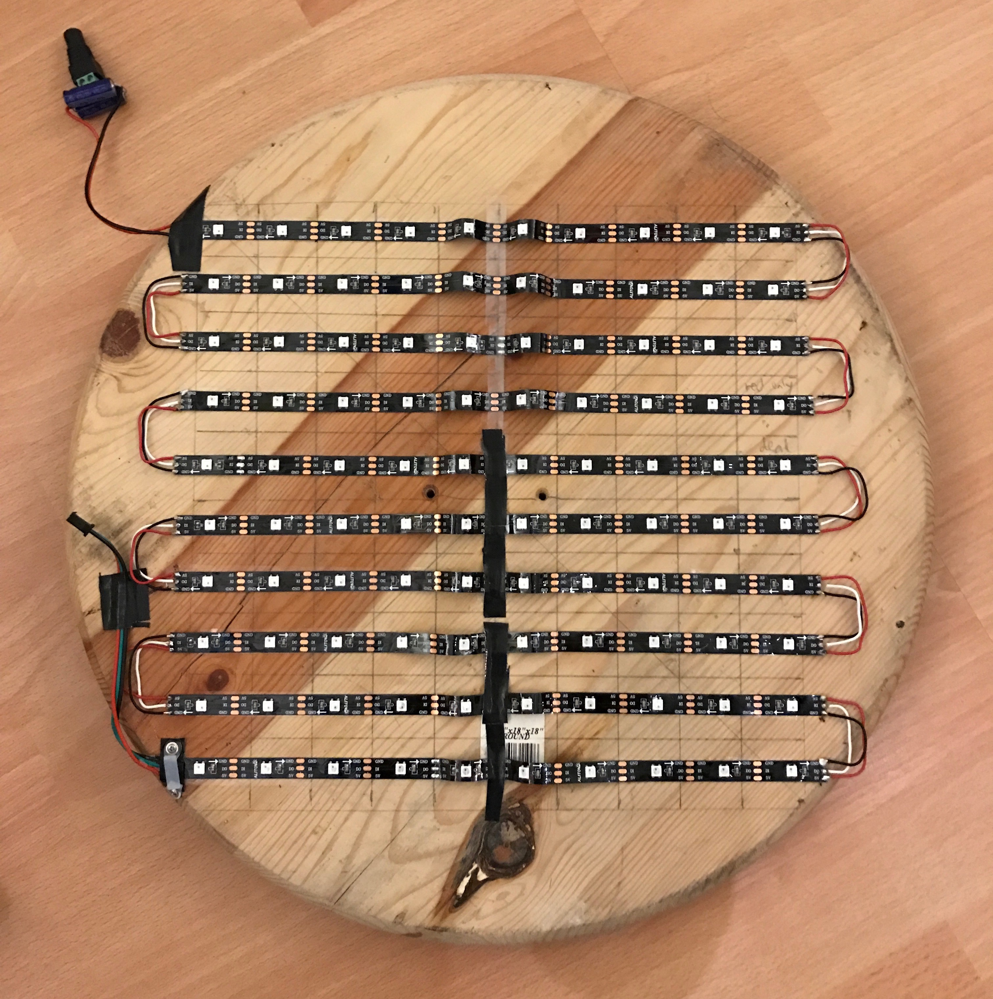
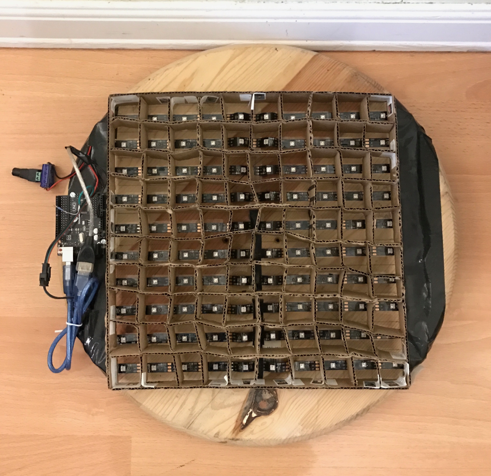
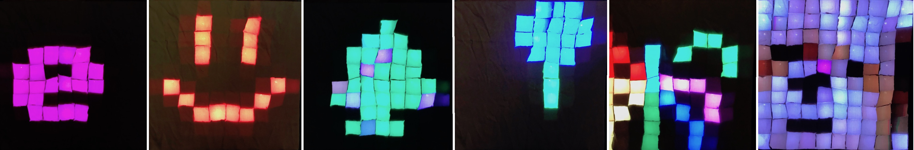

# README

PixArt is a 10x10 "screen" made with a NeoPixel-compatible LED  string.

This simple screen shows, in order:
* Alphanumeric text
* A Christmas tree with flashing lights
* Fireworks
* Birthday balloons
* "Picture" of a dog

The dog image is read from a PPM P3 10x10 "file".

## Hardware required

* [Arduino Uno](http://arduino.cc/en/Main/arduinoBoardUno) (it will probably work with other variants, but I've only tested it with the Uno)
* WS2812 Individually Addressable LED Strip Light (NeoPixel-compatible) with 100 or more LEDs
* 50W 5V power supply (to drive the LEDs)
* 1000uF capacitor to smooth out the output of the power supply
* Small (220-470 ohm) series resistor - used between the Arduino (pin 2) and the WS2812’s data input
* Wire and solder (to electrically-connect the cut LED strips)
* Wood, cardboard, tape

## Building the screen

## Final Result

